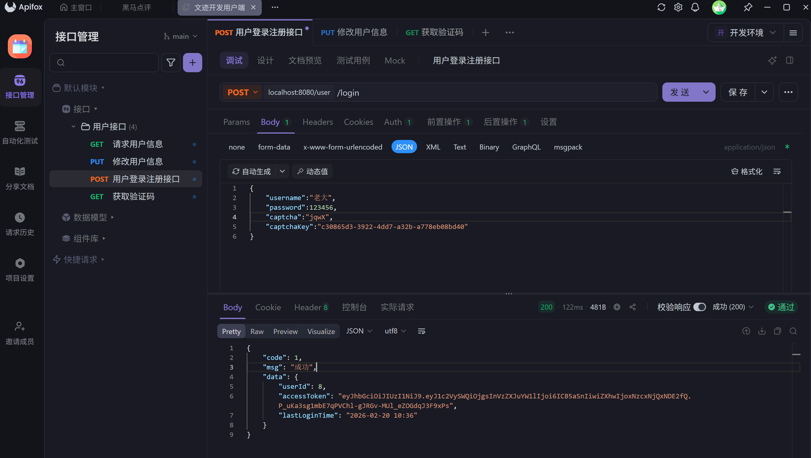

# 1-20-2026

## 数据库修改：

### **heritage_sites表中记录经纬度字段类型（DECIMAL 类型）应该使用 MySQL 的几何类型字段**

```mysql
	'location_point' POINT COMMENT '地理位置点',  -- 新增几何字段
    -- 索引
    INDEX idx_province_code(province_code),
    INDEX idx_city_code(city_code),
    INDEX idx_level(level),
    INDEX idx_type(type),
    INDEX idx_geohash(geohash),
    INDEX idx_popularity(popularity),
    SPATIAL INDEX idx_location(location_point)  -- 空间索引
    
    SPATIAL 索引要求：几何字段必须为 NOT NULL
```

### 添加外键：

```mysql
-- 为 opening_hours 表添加外键
ALTER TABLE opening_hours
ADD CONSTRAINT fk_opening_hours_site
FOREIGN KEY (site_id) REFERENCES heritage_sites(site_id);

-- 为 site_images 表添加外键
ALTER TABLE site_images
ADD CONSTRAINT fk_site_images_site
FOREIGN KEY (site_id) REFERENCES heritage_sites(site_id);
```
## HeritageController接口调试：

输入信息：

**GET http://localhost:8080/map/initial?lng=116.3&lat=39.9**

输出信息：

```json
{
    "code": 1,
    "msg": "成功",
    "data": [
        {
            "siteId": "S001",
            "siteCode": "BJ_001",
            "name": "故宫博物院（木结构营造技艺）",
            "type": 1,
            "level": "国家级",
            "provinceCode": "110000",
            "cityCode": "110100",
            "address": "北京市东城区景山前街4号",
            "latitude": 39.9163000,
            "longitude": 116.3974000,
            "locationPoint": "AAAAAAEBAAAAjNtoAG8ZXUCTqYJRSfVDQA==",
            "status": 1,
            "isRecommended": true,
            "popularity": 9.90,
            "visitCount": 0,
            "rating": 4.90,
            "createTime": "2026-01-20 12:45:05",
            "updateTime": "2026-01-20T12:45:05",
            "distance": 942.9034358103929,
            "images": [
                {
                    "imageId": 1,
                    "siteId": "S001",
                    "imageUrl": "https://example.com/gugong_cover.jpg",
                    "sortOrder": 1,
                    "isCover": true,
                    "status": 1,
                    "createTime": "2026-01-20 12:45:21"
                }
            ],
            "openingHours": [
                {
                    "hourId": 1,
                    "siteId": "S001",
                    "dayOfWeek": 1,
                    "openTime": "08:30:00",
                    "closeTime": "17:00:00",
                    "isOpen": true,
                    "createTime": "2026-01-20 12:45:15",
                    "updateTime": "2026-01-20T12:45:15"
                },
                {
                    "hourId": 2,
                    "siteId": "S001",
                    "dayOfWeek": 2,
                    "openTime": "08:30:00",
                    "closeTime": "17:00:00",
                    "isOpen": true,
                    "createTime": "2026-01-20 12:45:15",
                    "updateTime": "2026-01-20T12:45:15"
                }
            ],
            "isOpening": true
        },
        {
            "siteId": "S002",
            "siteCode": "XA_001",
            "name": "西安城隍庙庙会",
            "type": 2,
            "level": "省级",
            "provinceCode": "610000",
            "cityCode": "610100",
            "address": "西安市西大街129号",
            "latitude": 34.2633000,
            "longitude": 108.9393000,
            "locationPoint": "AAAAAAEBAAAAgEi/fR08W0C2hHzQsyFBQA==",
            "status": 1,
            "isRecommended": true,
            "popularity": 8.50,
            "visitCount": 0,
            "rating": 4.50,
            "createTime": "2026-01-20 12:45:05",
            "updateTime": "2026-01-20T12:45:05",
            "distance": 910954.4982613013,
            "images": [
                {
                    "imageId": 2,
                    "siteId": "S002",
                    "imageUrl": "https://example.com/chenghuangmiao.jpg",
                    "sortOrder": 1,
                    "isCover": true,
                    "status": 1,
                    "createTime": "2026-01-20 12:45:21"
                }
            ],
            "openingHours": [
                {
                    "hourId": 3,
                    "siteId": "S002",
                    "dayOfWeek": 1,
                    "openTime": "09:00:00",
                    "closeTime": "18:00:00",
                    "isOpen": true,
                    "createTime": "2026-01-20 12:45:15",
                    "updateTime": "2026-01-20T12:45:15"
                }
            ],
            "isOpening": false
        }
    ]
}
```


# 1-21-2026
## 修改User实体类,添加UserUpdateDTO
## 修复登录模式，将token存入Redis，完善loginInterceptor功能
## 新建请求用户信息和更新用户信息的方法
GET /admin/users/{user_id}
PUT /admin/users/update/{user_id}

## 完善ApiFox自动获取令牌的功能
### 登录接口
1. 在登录接口的后置操作复制以下代码
// 如果你的响应格式是 { "code": 200, "data": { "token": "xxx" } }
```javascript
if (pm.response.code === 200) {
const data = pm.response.json();
pm.environment.set("token", data.data.accessToken);
console.log("Token 已自动保存：", data.data.accessToken);
}
```
2. 在其他接口的Auth区域设置请求头，选择 Bear Token，输入{{token}}
最后返回测试

## 新建修改用户密码的接口
PUT /admin/users/updatePassword/{user_id}

## 创建ai
### 创建数据表 ai_chat_session
```sql
-- AI对话会话表
CREATE TABLE ai_chat_session (
    session_id VARCHAR(64) PRIMARY KEY,
    user_id INT,
    current_location VARCHAR(100),
    session_context JSON,
    message_count INT DEFAULT 0,
    start_time DATETIME DEFAULT CURRENT_TIMESTAMP,
    last_active_time DATETIME,
    status VARCHAR(20) DEFAULT 'active',
    INDEX idx_user_session (user_id, last_active_time DESC),
    FOREIGN KEY (user_id) REFERENCES user(user_id)
)Enginee=innoDB DEFAULT CHARSET=utf8mb4 comment='AI对话会话表';
-- AI对话会话表


-- AI对话消息表
CREATE TABLE ai_chat_message (
    message_id BIGINT PRIMARY KEY AUTO_INCREMENT,
    session_id VARCHAR(64) NOT NULL,
    role VARCHAR(20) NOT NULL,
    content TEXT,
    message_type VARCHAR(20) DEFAULT 'text',
    tool_calls JSON,
    metadata JSON,
    create_time DATETIME DEFAULT CURRENT_TIMESTAMP,
    INDEX idx_session_time (session_id, create_time),
    FOREIGN KEY (session_id) REFERENCES ai_chat_session(session_id)
)Enginee=innoDB DEFAULT CHARSET=utf8mb4 comment='AI对话消息表';

-- 图片识别记录表
CREATE TABLE image_recognition_log (
    recognition_id BIGINT PRIMARY KEY AUTO_INCREMENT,
    session_id VARCHAR(64),
    user_id INT,
    image_hash VARCHAR(64) UNIQUE,
    site_id VARCHAR(50),
    confidence DECIMAL(5,4),
    original_image_url VARCHAR(500),
    recognition_result JSON,
    create_time DATETIME DEFAULT CURRENT_TIMESTAMP,
    INDEX idx_image_hash (image_hash),
    INDEX idx_user_time (user_id, create_time DESC),
    FOREIGN KEY (session_id) REFERENCES ai_chat_session(session_id),
    FOREIGN KEY (user_id) REFERENCES user(user_id),
    FOREIGN KEY (site_id) REFERENCES heritage_site(site_id)
)Enginee=innoDB DEFAULT CHARSET=utf8mb4 comment='图片识别记录表';

-- 工具调用记录表
CREATE TABLE tool_usage_log (
    tool_usage_id BIGINT PRIMARY KEY AUTO_INCREMENT,
    session_id VARCHAR(64),
    tool_type VARCHAR(50) NOT NULL,
    tool_parameters JSON,
    call_result TEXT,
    success TINYINT(1) DEFAULT 1,
    call_time DATETIME DEFAULT CURRENT_TIMESTAMP,
    INDEX idx_session_tool (session_id, tool_type),
    FOREIGN KEY (session_id) REFERENCES ai_chat_session(session_id)
)Enginee=innoDB DEFAULT CHARSET=utf8mb4 comment='工具调用记录表';

-- 用户偏好表
CREATE TABLE user_preference (
    preference_id BIGINT PRIMARY KEY AUTO_INCREMENT,
    user_id INT NOT NULL,
    preference_type VARCHAR(50) NOT NULL,
    preference_value JSON,
    weight INT DEFAULT 1,
    update_time DATETIME DEFAULT CURRENT_TIMESTAMP ON UPDATE CURRENT_TIMESTAMP,
    UNIQUE KEY uk_user_preference (user_id, preference_type),
    FOREIGN KEY (user_id) REFERENCES user(user_id)
)Enginee=innoDB DEFAULT CHARSET=utf8mb4 comment='用户偏好表';
```
### 完成ai智能体图文对话的初步配置

1-22-2026
## 创建操作日志表
1-29-2026
## 完成用户信息修改的完善

1-31-2026
## 完成用户信息删除功能


2-19-2026
## 修改实体类Result错误返回的返回值

2-20-2026
**后端**
## 将注册登录功能合二为一，同时添加验证码机制
## 添加缓存redis，存储用户每次登录/注册时点击获取验证码，5分钟后失效 ，(CaptchaController、CaptchaUtils、RedisConstants)
## 将实体类验证信息是否合法直接集成到RegexUtils中
## 拦截器修改不拦截获取验证码信息
## 在yaml文件中设置redis等基础信息

---
2-22-2026
# 总结
## 完善测试用户登录注册功能
## 修改用户修改个人信息url、注销用户url、获取用户信息url
## 通过ThreadLocal进行用户信息的存取

# UserController 接口文档更新

## 基础信息
- **基础路径**: `/user`
- **认证方式**: Bearer Token (除登录接口外都需要认证)
- **返回格式**: 统一使用 `Result<T>` 对象

## 1. 用户登录/注册
**POST** `/user/login`

### 请求头
Authorization: Bearer <token>
### 请求参数 (LoginFormDTO)
| 字段名 | 类型 | 必填 | 说明 |
|--------|------|------|------|
| phone | String | 是 | 手机号 |
| username | String | 是 | 用户名 |
| password | String | 是 | 密码 |
| rePassword | String | 否 | 确认密码(注册时必填) |
| captcha | String | 否 | 验证码 |
| captchaKey | String | 否 | 验证码标识 |

### 成功响应示例
```json 
{
       "code": 1, 
       "msg": "成功",
       "data": { 
          "accessToken": "eyJhbGciOiJIUzI1NiIsInR5cCI6IkpXVCJ9...", 
          "userInfo": { 
            "username": "testuser", 
            "phone": "13800138000", 
            "email": "test@example.com", 
            "avatarUrl": "https://example.com/avatar.jpg", 
            "level": "见习学徒", 
            "createTime": "2026-02-22 10:30:00", 
            "lastLoginTime": "2026-02-22 10:30:00", 
            "isRealNameVerified": 0, 
            "experience": 0
          }
       }
}
```
---

## 2. 用户登出
**POST** `/user/logout`

### 请求头
Authorization: Bearer <token>

---

## 3. 获取当前用户信息
**GET** `/user/currentUserInfo`

### 请求头
Authorization: Bearer <token>

### 响应数据 (UserInfoVO)
| 字段名 | 类型 | 说明 |
|--------|------|------|
| username | String | 用户名 |
| gender | String | 性别 |
| phone | String | 手机号 |
| realName | String | 真实姓名 |
| email | String | 邮箱 |
| avatarUrl | String | 头像URL |
| level | String | 等级 |
| createTime | String | 创建时间 (yyyy-MM-dd HH:mm:ss) |
| updateTime | String | 更新时间 (yyyy-MM-dd HH:mm:ss) |
| lastLoginTime | String | 最后登录时间 (yyyy-MM-dd HH:mm:ss) |
| isRealNameVerified | Integer | 是否实名认证 (0:未认证, 1:已认证) |
| experience | Integer | 经验值 |

### 成功响应示例
```json
{
  "code": 1,
  "msg": "成功",
  "data": {
    "username": "testuser",
    "gender": "男",
    "phone": "13800138000",
    "realName": "张三",
    "email": "test@example.com",
    "avatarUrl": "https://example.com/avatar.jpg",
    "level": "见习学徒",
    "createTime": "2026-02-22 10:30:00",
    "updateTime": "2026-02-22 10:30:00",
    "lastLoginTime": "2026-02-22 10:30:00",
    "isRealNameVerified": 1,
    "experience": 100
  }
}
```
---

## 4. 修改用户信息
**PUT** `/user/updateUserInfo`

### 请求头
Authorization: Bearer <token>

### 请求参数 (UserUpdateDTO)
| 字段名 | 类型 | 必填 | 说明 |
|--------|------|------|------|
| username | String | 是 | 用户名 |
| gender | String | 否 | 性别 |
| password | String | 否 | 原密码(修改密码时必填) |
| newPassword | String | 否 | 新密码 |
| rePassword | String | 否 | 确认新密码 |
| phone | String | 否 | 手机号(需符合正则格式) |
| realName | String | 否 | 真实姓名 |
| email | String | 否 | 邮箱(需符合邮箱格式) |
| avatarUrl | String | 否 | 头像URL |
| level | String | 否 | 等级 |
| birthday | String | 否 | 生日 (yyyy-MM-dd) |
| updateTime | String | 否 | 更新时间 (yyyy-MM-dd HH:mm:ss) |
| lastLoginTime | String | 否 | 最后登录时间 (yyyy-MM-dd HH:mm:ss) |
| isRealNameVerified | Integer | 否 | 是否实名认证 |
| experience | Integer | 否 | 经验值 |

### 成功响应示例
```json
{
    "code": 1, 
    "msg": "成功", 
    "data": { 
        "username": "updateduser", 
        "gender": "女", 
        "phone": "13900139000", 
        "realName": "李四", 
        "email": "updated@example.com", 
        "avatarUrl": "https://example.com/new_avatar.jpg", 
        "level": "初级学者", 
        "createTime": "2026-02-22 10:30:00", 
        "updateTime": "2026-02-22 11:00:00", 
        "lastLoginTime": "2026-02-22 11:00:00", 
        "isRealNameVerified": 1, 
        "experience": 200 
        } 
}
```

---

## 5. 注销用户
**DELETE** `/user/deleteUserInfo`

### 请求头
Authorization: Bearer <token>

---

# 2-26-2026
## 前后端接口对接优化

### 1. 验证码字段名统一
**问题**：前端使用`captchaCode`字段，后端使用`captcha`字段，导致验证失败

**解决方案**：
- 修改前端LoginRegister.vue，统一使用`captcha`字段名
- 修改位置：数据模型、登录函数、校验规则、模板绑定

### 2. API路径优化
**问题**：前端在URL中拼接userId，与后端设计不符

**解决方案**：
- 修改前端user.js中的API调用
- 所有用户相关接口统一使用token认证，不在URL中传递userId

**修改的接口**：
1. getCurrentUserInfo: `/user/info/${userId}` → `/user/currentUserInfo`
2. updateContact: `/user/update/${userId}` → `/user/update`
3. updateUserInfo: `/user/updateUserInfo/${userId}` → `/user/updateUserInfo`
4. deleteUserAccount: `/user/deleteUserInfo/${userId}` → `/user/deleteUserInfo`
5. updatePassword: `/user/updatePassword/${userId}` → `/user/updatePassword`

### 3. 安全性提升
- 避免在URL中暴露用户ID
- 统一使用token进行认证
- 所有接口从请求头中解析token获取userId

### 4. 认证流程
1. 前端在请求头中携带token（通过request拦截器自动添加）
2. 后端从请求头中获取token（支持Authorization和authorization两种大小写形式）
3. 后端解析token获取userId
4. 后端执行相应的业务逻辑

# 10个初始化景点信息
```sql
INSERT INTO heritage_sites 
(site_id, site_code, name, type, level, province_code, city_code, address, latitude, longitude, location_point, cover_image, description, history, techniques, status, is_recommended, popularity, rating)
VALUES
-- 1. 北京：故宫博物院 (古建筑营造技艺)
('1', 'BJ-GUGONG-001', '故宫博物院', 1, '国家级', '110000', '110100', '北京市东城区景山前街4号', 39.9163447, 116.3971285, ST_GeomFromText('POINT(116.3971285 39.9163447)'), 'https://example.com/images/gugong.jpg', '世界现存规模最大、保存最为完整的木质结构古建筑群。', '始建于明永乐四年（1406年），历经明清两代。', '官式古建筑营造技艺，包括斗拱、彩画、榫卯结构等。', 1, 1, 99.5, 4.9),

-- 2. 苏州：拙政园 (苏州园林)
('2', 'JS-ZZY-002', '拙政园', 1, '世界级', '320000', '320500', '江苏省苏州市姑苏区东北街178号', 31.323067, 120.625121, ST_GeomFromText('POINT(120.625121 31.323067)'), 'https://example.com/images/zhuozhengyuan.jpg', '中国四大名园之一，以水为中心，山水萦绕。', '始建于明正德初年，是江南古典园林的代表。', '叠石、理水、建筑与花木的艺术组合方案。', 1, 1, 95.0, 4.8),

-- 3. 杭州：西湖 (龙井茶制作技艺)
('3', 'ZJ-XIHU-003', '西湖风景名胜区', 2, '国家级', '330000', '330100', '浙江省杭州市西湖区龙井路1号', 30.24197, 120.13845, ST_GeomFromText('POINT(120.13845 30.24197)'), 'https://example.com/images/xihu.jpg', '三面环山，一脉晴岚，是中国主要的观赏性淡水湖泊。', '历史悠久，自唐以来便是名胜，深受文人墨客青睐。', '西湖龙井茶采摘与手工炒制技艺。', 1, 1, 98.0, 4.7),

-- 4. 西安：秦始皇陵兵马俑 (陶俑烧制)
('4', 'SX-BMY-004', '秦始皇兵马俑博物馆', 1, '世界级', '610000', '610100', '陕西省西安市临潼区秦陵街道', 34.38411, 109.27853, ST_GeomFromText('POINT(109.27853 34.38411)'), 'https://example.com/images/bimy.jpg', '被誉为“世界第八大奇迹”。', '秦始皇陵的陪葬坑，发现于1974年。', '古代大型陶塑艺术，千人千面，工艺精湛。', 1, 0, 97.0, 4.9),

-- 5. 景德镇：古窑民俗博览区 (陶瓷手工技艺)
('5', 'JX-GY-005', '景德镇古窑民俗博览区', 4, '国家级', '360000', '360200', '江西省景德镇市昌江区瓷都大道', 29.28821, 117.18956, ST_GeomFromText('POINT(117.18956 29.28821)'), 'https://example.com/images/jdz.jpg', '全国唯一一家以陶瓷文化为主题的国家5A级旅游景区。', '景德镇千年瓷都的缩影，展示了明清时期的古窑。', '手工制瓷技艺，包括拉坯、利坯、画坯、施釉等。', 1, 0, 88.5, 4.6),

-- 6. 泉州：开元寺 (南音/刺桐文化)
('6', 'FJ-KYS-006', '泉州开元寺', 1, '省市级', '350000', '350500', '福建省泉州市鲤城区西街176号', 24.91456, 118.58284, ST_GeomFromText('POINT(118.58284 24.91456)'), 'https://example.com/images/ky.jpg', '福建省内规模最大的佛教寺院。', '始建于唐垂拱二年（686年）。', '拥有双塔结构，是海上丝绸之路的重要遗迹。', 1, 0, 85.0, 4.5),

-- 7. 广州：陈家祠 (岭南建筑艺术)
('7', 'GD-CJC-007', '广东民间工艺博物馆', 1, '国家级', '440000', '440100', '广东省广州市荔湾区中山七路恩龙里34号', 23.12658, 113.24357, ST_GeomFromText('POINT(113.24357 23.12658)'), 'https://example.com/images/cjc.jpg', '岭南建筑艺术的明珠。', '清末陈氏书院。', '集木雕、石雕、砖雕、陶塑、灰塑、铜铁铸及彩绘于一体。', 1, 0, 91.0, 4.7),

-- 8. 洛阳：龙门石窟 (石刻艺术)
('8', 'HA-LMSK-008', '龙门石窟', 1, '世界级', '410000', '410300', '河南省洛阳市龙门镇', 34.55748, 112.47352, ST_GeomFromText('POINT(112.47352 34.55748)'), 'https://example.com/images/lm.jpg', '中国石刻艺术最高峰之一。', '开凿于北魏孝文帝年间，跨越多个朝代。', '大规模崖壁石雕技艺，佛像造型生动。', 1, 1, 94.0, 4.8),

-- 9. 黔东南：西江千户苗寨 (苗族吊脚楼)
('9', 'GZ-MZ-009', '西江千户苗寨', 3, '国家级', '520000', '522600', '贵州省黔东南苗族侗族自治州雷山县', 26.49504, 108.17382, ST_GeomFromText('POINT(108.17382 26.49504)'), 'https://example.com/images/mz.jpg', '全世界最大的苗族聚居村寨。', '保留了苗族“原始生态”文化。', '苗族吊脚楼营造技艺，木质结构干栏式建筑。', 1, 1, 90.0, 4.4),

-- 10. 敦煌：莫高窟 (壁画艺术)
('10', 'GS-MGK-010', '敦煌莫高窟', 1, '世界级', '620000', '620900', '甘肃省酒泉市敦煌市', 40.03541, 94.80215, ST_GeomFromText('POINT(94.80215 40.03541)'), 'https://example.com/images/mgk.jpg', '举世闻名的佛教艺术胜地。', '始建于前秦建元二年。', '精美的壁画和彩塑艺术，反映了千年的社会变迁。', 1, 1, 99.0, 4.9);
```